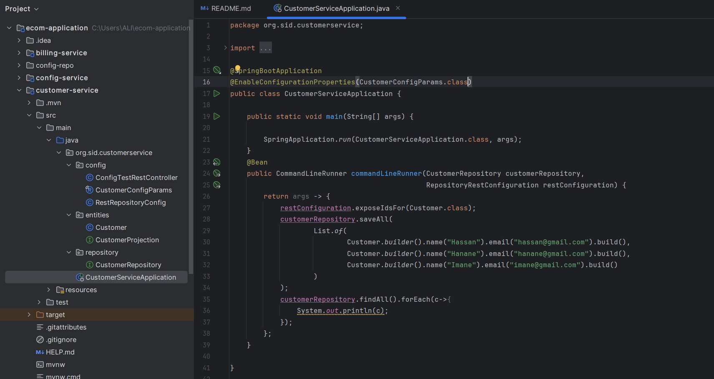
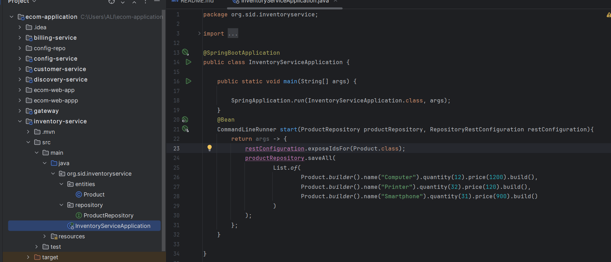
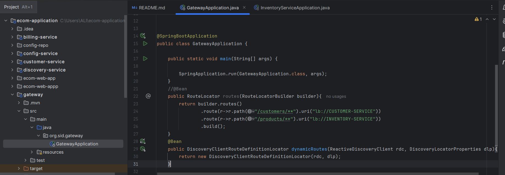
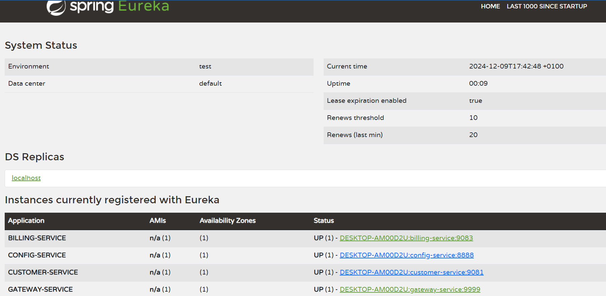
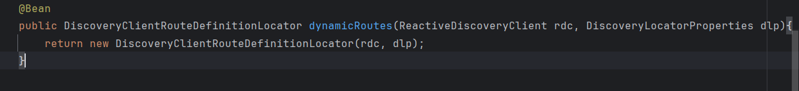
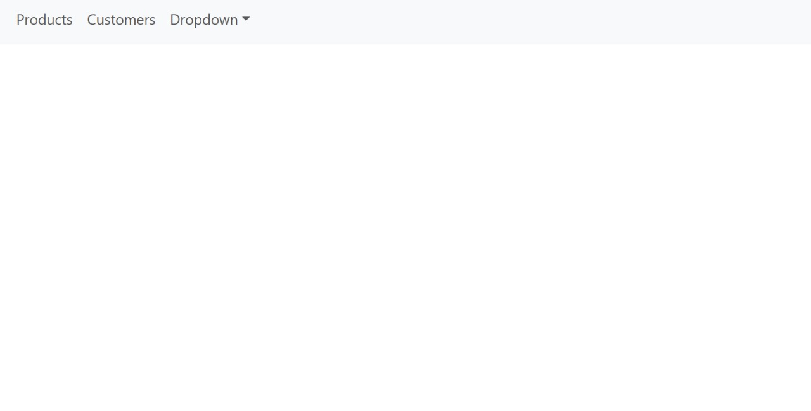

# E-Commerce Microservices Project

Ce projet est une architecture de microservices pour une application d'e-commerce. Il comprend plusieurs services, une gateway, un service de découverte et un client Angular.

## **Architecture**

### **Microservices**
1. **Customer Service** : Gestion des clients.
2. **Inventory Service** : Gestion des produits.
3. **Billing Service** : Gestion de la facturation.
4. **Gateway** : Une passerelle basée sur Spring Cloud Gateway pour le routage.
5. **Eureka Discovery Service** : Annuaire pour enregistrer et découvrir les microservices.
6. **Configuration Service** : Centralisation de la configuration des microservices.

### **Client Frontend**
Un client développé en Angular pour interagir avec les microservices.

---

## **Fonctionnalités principales**
- **Gestion des clients** : CRUD pour les informations clients via `customer-service`.
- **Gestion des produits** : CRUD pour les produits via `inventory-service`.
- **Facturation** : Génération de factures en utilisant Open Feign via `billing-service`.
- **Routage statique et dynamique** : Configuration des routes avec Spring Cloud Gateway.
- **Service de découverte** : Intégration avec Eureka pour le registre des services.
- **Configuration centralisée** : Gestion des configurations via Spring Cloud Config Server.
- **Frontend Angular** : Application cliente pour visualiser et interagir avec les services.

---

## **Screenshots**

### **Customer Service**
Interface ou API pour gérer les clients.

---

### **Inventory Service**
Interface ou API pour gérer les produits.

---

### **API Gateway**

---

### **Configuration statique de system routage**.

---

### **Eureka Discovery Service**
Page d'accueil d'Eureka affichant les microservices enregistrés.

---

### **Configuration dynamique**

---

### **Angular Frontend**
Application cliente affichant les données des microservices.

---

